# NAIS Web

국가과학AI연구센터(NAIS, National AI for Science Research Center) 홈페이지를 직접 설계하고 구현한 프로젝트입니다.
과학기술 분야 출연연을 잇는 **AI for Science 허브**라는 센터의 정체성을, 스크롤에 따라 형태가 바뀌는 WebGL 입자 장면으로 표현했습니다.

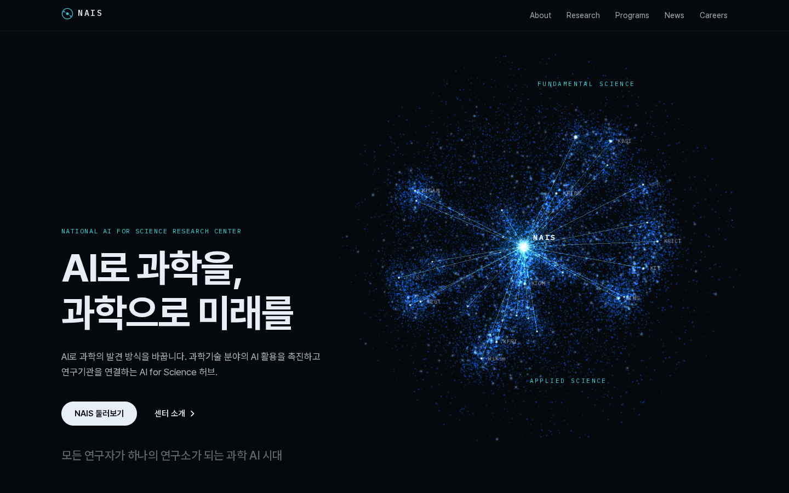

- 스택: Next.js 16 (Static Export) · React 19 · TypeScript · Tailwind CSS 4 · React Three Fiber / three.js · Zustand
- 테스트: Vitest(단위) · Playwright(e2e, 데스크톱·모바일) · Lighthouse
- 배포: 정적 빌드(`out/`) → 개인 서버 Nginx
- 시스템 구조와 설계 결정은 [docs/SYSTEM.md](docs/SYSTEM.md)에 정리했습니다.

## 주요 기능

- **스크롤 연동 입자 장면** — 최대 40,000개 입자가 섹션마다 크기·회전·기울기·색조·유체 흐름을 부드럽게 바꿉니다. 커스텀 GLSL 셰이더와 curl noise를 씁니다.
- **연구기관 허브 구체** — 가운데 NAIS 코어와 소관 연구기관 25곳을 노드·연결선으로 배치했습니다. 경도는 연구 분야, 위도는 기초→응용 과학을 뜻합니다.
- **한반도 도트 매트릭스 지도** — 실제 국경 데이터로 만든 지도 위에 25개 기관 소재지를 찍고, NAIS로 모이는 데이터 흐름을 패킷 애니메이션으로 보여줍니다.
- **기관 사이트 수준의 하위 페이지** — 센터 소개·연혁·조직도(부서 선택 시 직위별 담당업무)·연구·사업·소식.
- **사업 모집 상태 자동 계산** — 한국 시간 기준으로 예정/진행 중/마감을 보는 사람의 현재 시각에 맞춰 1분마다 갱신합니다.
- **성능·접근성** — 3D 레이어 지연 로드, 기기 성능에 따른 입자 수 조절, WebGL2 미지원 시 대체 화면, `prefers-reduced-motion` 대응.
- **사실 기반 콘텐츠** — 모든 문구는 공개된 공식 자료에서 확인한 내용만 쓰고, 출처를 데이터 파일에 주석으로 남겼습니다.

## 화면

### 홈 (데스크톱)

| 01 AI Platform | 02 AI Convergence |
|---|---|
| 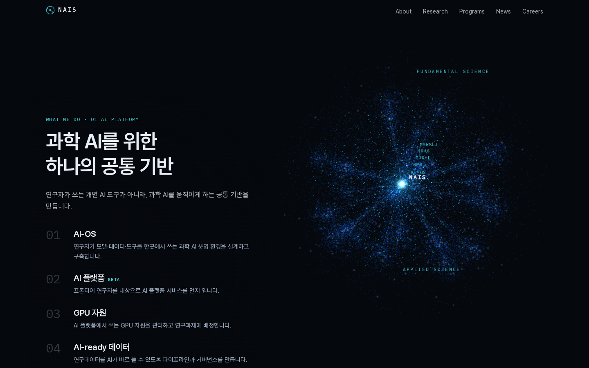 | 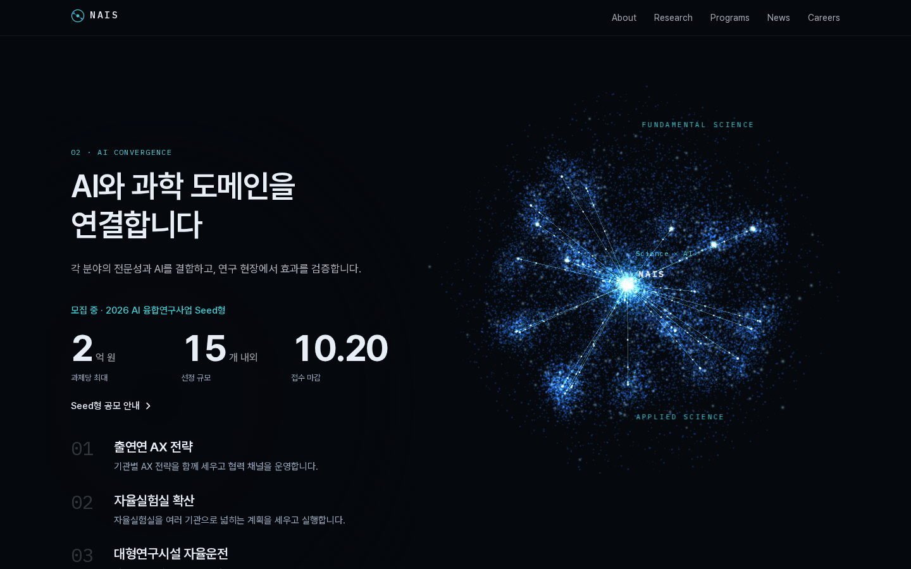 |
| **03 Autonomous Science** | **04 K-Moonshot** |
| 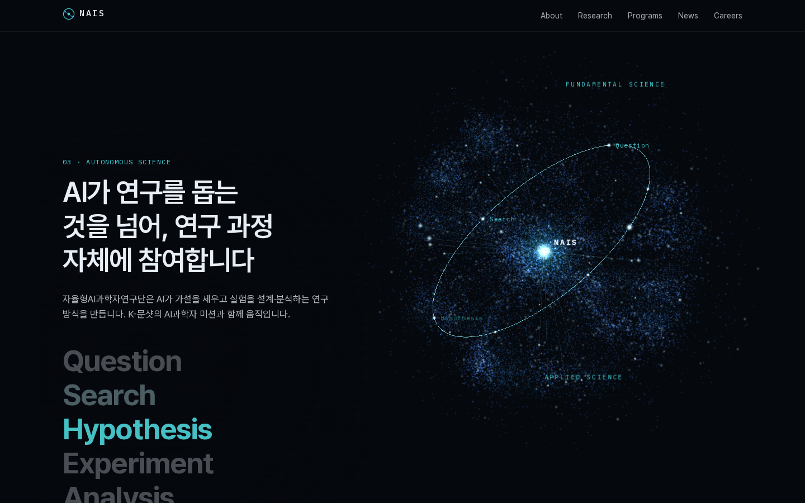 | 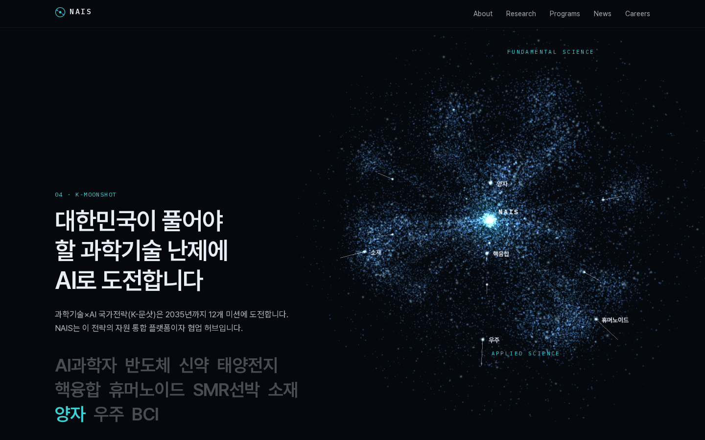 |
| **05 Research Ecosystem** | **News & Careers** |
| 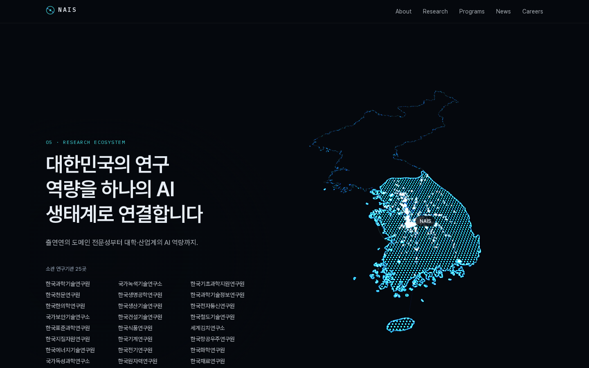 | 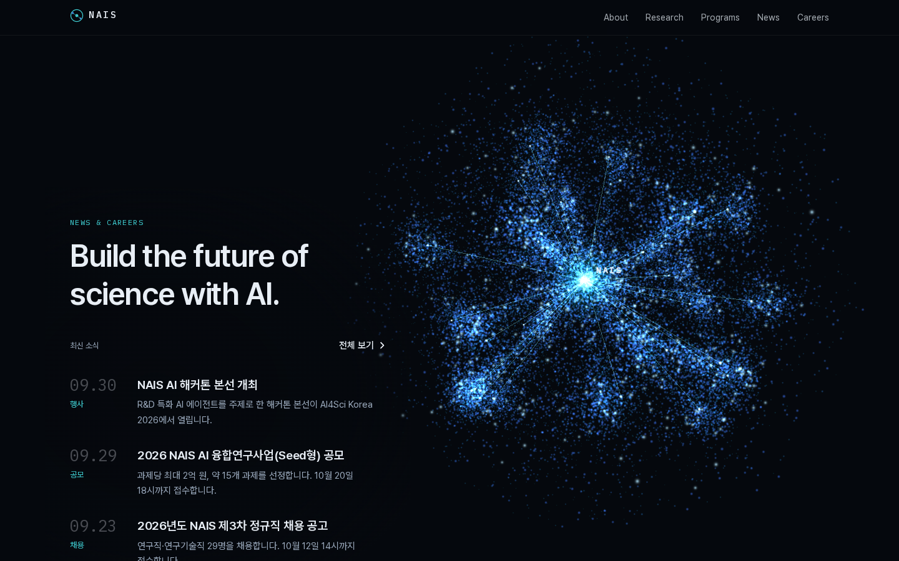 |

### 하위 페이지

| 센터 소개 | 조직도 |
|---|---|
| 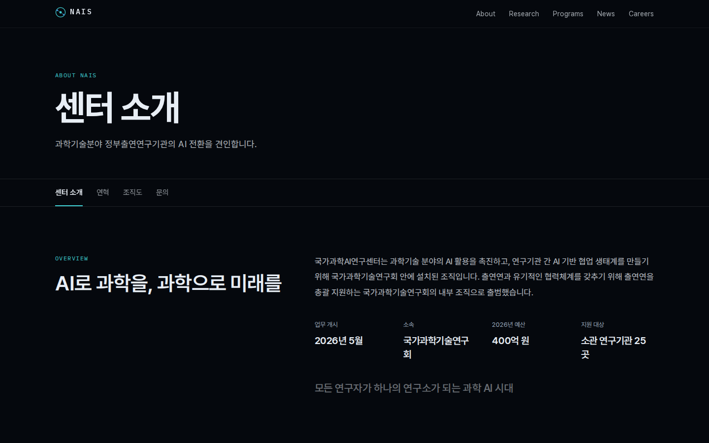 | 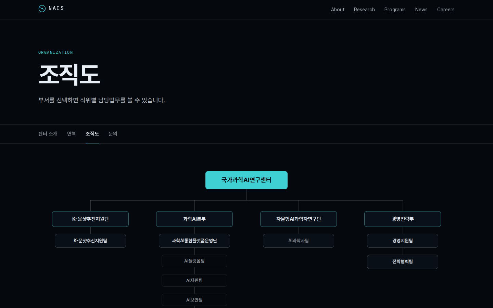 |
| **연구** | **사업** |
| 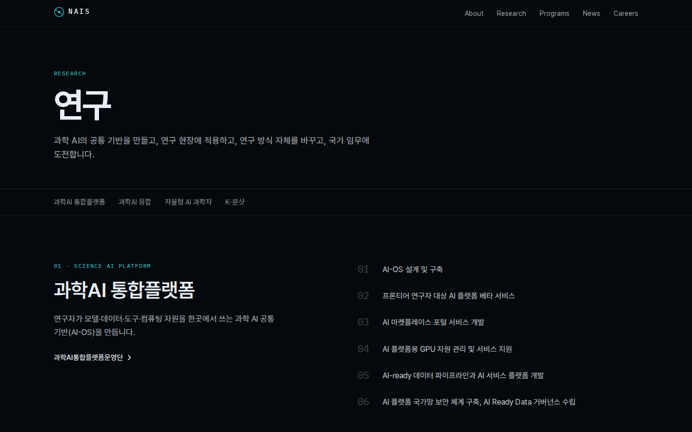 | 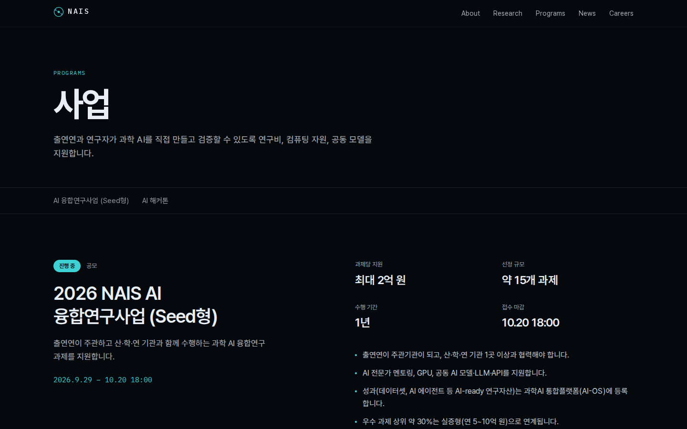 |
| **소식** | |
| 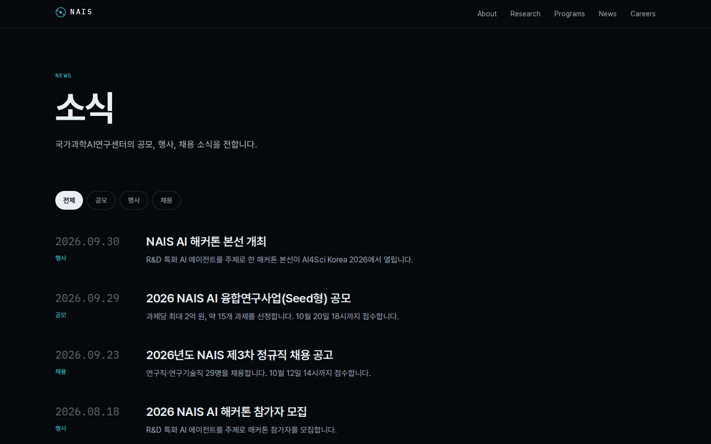 | |

### 모바일

<p>
  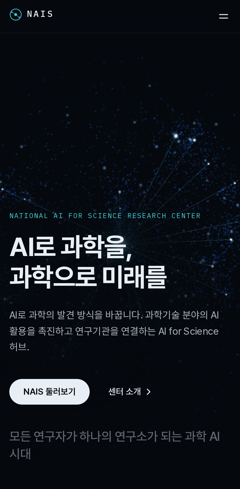
  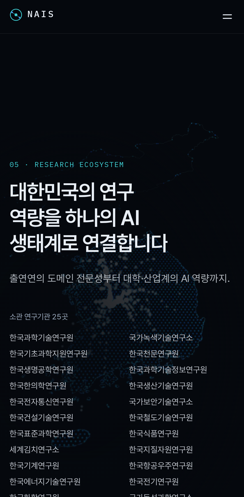
</p>

## 개발

```bash
npm install
npm run dev          # http://localhost:3000
npm test             # 단위 테스트
npm run test:e2e     # 빌드 + e2e
npm run lighthouse   # (out/을 4173에서 서빙 중일 때) 모바일 Lighthouse
```

외부 주소에서 개발 서버를 볼 때는 허용할 호스트를 환경변수로 넘깁니다.

```bash
DEV_ORIGINS=<외부 IP 또는 도메인> npx next dev -H 0.0.0.0 -p <포트>
```

## 배포 (개인 서버 Nginx)

```bash
NEXT_PUBLIC_SITE_URL=https://<도메인> npm run build
rsync -av --delete out/ <user>@<server>:/var/www/nais-web/
# 서버: deploy/nginx.conf를 /etc/nginx/sites-available/에 두고 server_name 수정 후
sudo nginx -t && sudo systemctl reload nginx
```

## 참고

기관 CI 이미지 출처는 [public/ci/SOURCE.md](public/ci/SOURCE.md)에 있습니다. NAIS 로고는 공식 이미지 대신 직접 디자인한 텍스트 워드마크를 사용합니다.
